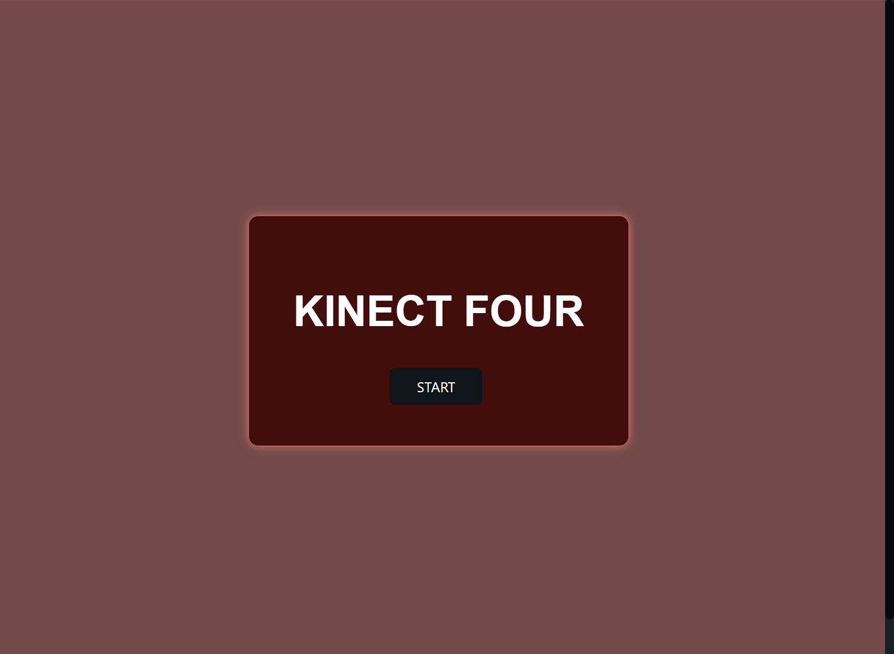
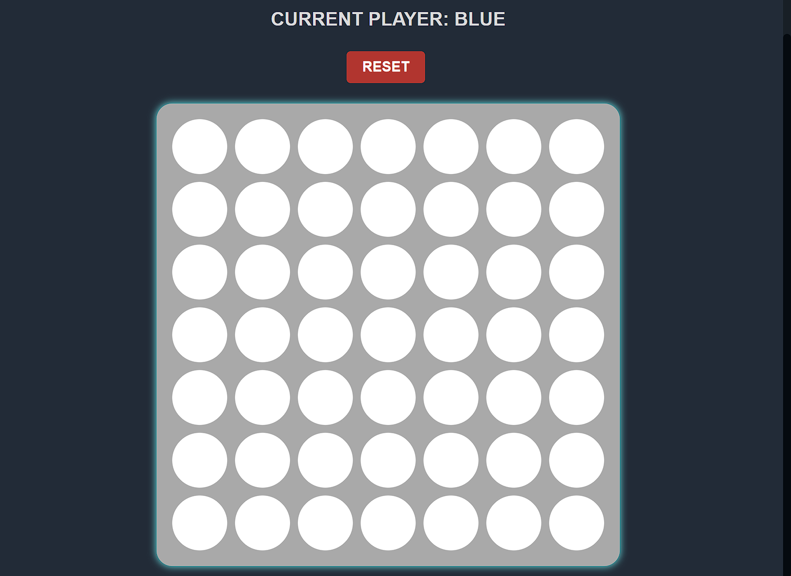

# Kinect Four

Kinect Four is a simple web-based implementation of the classic Connect Four game. It allows two players to compete against each other in a race to connect four of their colored discs in a row, either horizontally, vertically, or diagonally.

---
# To play the deployed version of the app, go [HERE](https://kinect-four.fly.dev/)!

## Features

- Interactive gameplay with a user-friendly interface.
- Turn-based gameplay, alternating between the two players.
- Real-time indication of the current player's turn.
- Responsive design for seamless experience on various devices.

## Technologies Used

- HTML5
- CSS3
- JavaScript

---

---
## Getting Started

To get a local copy of the game up and running, follow these steps:

1. Clone this repository: `git clone https://github.com/vader-v/kinect-four.git`
2. Navigate to the project's directory: `cd kinect-four`
3. Open the index.html file in your preferred web browser.

## How to Play

1. When the game starts, the first player will be assigned the color "blue," and the second player will be assigned the color "red."
2. Players take turns dropping one of their colored discs into any of the available columns.
3. The goal is to be the first to connect four of their colored discs in a row, either horizontally, vertically, or diagonally.
4. The game ends when one player achieves a winning combination or if the board is completely filled without a winner, resulting in a draw.
5. To start a new game, click the "Reset" button.

## Contributing

Contributions are welcome! If you find any issues or have suggestions for improvements, please submit a pull request or open an issue in this repository.

## Acknowledgements

- This project was developed as part of a coding exercise.
- This project was developed because of a love for connect four.